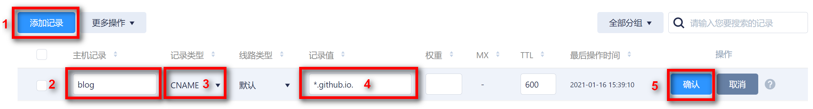

## 1. Install Node.js

### 1.1 Window

首先从[官网](http://nodejs.cn/download/)下载`nodejs`安装包进行安装，建议安装最新版本。安装后需确认将`node.js`安装路径添加到了系统环境变量中。安装路径示例如下：

```bash
D:\Program\nodejs\
```

### 1.2 Ubuntu

在Ubuntu环境下通过如下命令进行安装：

```bash
sudo apt update
sudo apt -y install curl dirmngr apt-transport-https lsb-release ca-certificates
curl -sL https://deb.nodesource.com/setup_12.x | sudo -E bash - # specify version >= 12.0, required for hexo-cli-i
sudo apt -y install nodejs
node --version
npm --version
```

## 2. Install Hexo and Configure

### 2.1 Install Hexo

输入如下命令安装`Hexo`:

```bash
npm install hexo-cli -g # it's same for different os
```

安装完成后输入以下指令验证是否安装成功：

```bash
hexo -v
```

在Windows环境运行上述指令时可能弹出“在此系统上禁止运行脚本”错误，其原因是Windows系统处于安全考虑，默认禁止脚本文件运行，可以通过在以管理员身份运行的`Powershell`中执行以下命令并选择`Y`选项解决：

```bash
set-executionpolicy remotesigned
```

另外因为众所周知的原因，国内网络环境下上述安装命令可能timeout，此时可以通过使用淘宝镜像解决此问题：

```bash
npm config set registry https://registry.npm.taobao.org
```

之后输入如下命令安装其他依赖项：

```bash
npm install
```

### 2.2 初始化博客文件夹

创建用于存放博客内容的目录，在该目录打开终端输入如下命令，初始化文件夹：

```bash
hexo init 
```

如果是已有的hexo项目，则可以直接跳过这一步。


### 2.3 常用操作

创建新的`post：

```bash
hexo new "文件名"
```

从当前`Markdown`文档生成网页：

```bash
hexo generate
hexo g
```

本地预览生成的网站：

```bash
hexo static
hexo s
```

将网站布置到云端：

```bash
hexo deploy
hexo d                                                              
```

## 3. 主题选择


## 4. 图床选择

### 4.1 Github图床

我们可以选择Github仓库作为图床。

#### 4.1.1 创建Github Repository

创建用于保存图片的仓库，将访问权限设置为公开。

#### 4.1.2 创建Token

点击Github网页版右上角头像，进入`设置`，在页面最下找到`Developer settings`点击进入，然后依次点击`Personal access token `，`创建token`，创建时设置如下：


Token description根据实际情况填写，`repo`下项必须勾选，其他项随意，创建成功后会生成一团字符token。

#### 4.1.3 PicGo安装和配置

PicGo是一个开源的图床工具，非常优秀。从[官网](https://github.com/Molunerfinn/PicGo)下载安装后，打开软件，在图床设置中选择`Github图床`，根据实际情况填写相应项目。

#### 4.1.4 Typora配置

Typora可以和PicGo联动，实现从剪切板复制到Typora的图片自动通过PicGo上传图床并在Typora中引用。配置时依次打开Typora的Preference->Image，然后按照下图进行配置。


配置完成后将剪切板中的图片复制到Typora，然后右键选择“上传图片”即可。

#### 4.1.5 其它问题

将Github作为图床有时候会出现图片加载失败的现象，这多半是由于DNS污染引起的，通过在`C:\Windows\System32\drivers\etc`内的`hosts`文件中添加如下内容直接对相关IP地址进行解析即可。

```bash
192.30.253.112    github.com 
192.30.253.119    gist.github.com
151.101.184.133    assets-cdn.github.com
151.101.184.133    raw.githubusercontent.com
151.101.184.133    gist.githubusercontent.com
151.101.184.133    cloud.githubusercontent.com
151.101.184.133    camo.githubusercontent.com
151.101.184.133    avatars0.githubusercontent.com
151.101.184.133    avatars1.githubusercontent.com
151.101.184.133    avatars2.githubusercontent.com
151.101.184.133    avatars3.githubusercontent.com
151.101.184.133    avatars4.githubusercontent.com
151.101.184.133    avatars5.githubusercontent.com
151.101.184.133    avatars6.githubusercontent.com
151.101.184.133    avatars7.githubusercontent.com
151.101.184.133    avatars8.githubusercontent.com
```

### 4.2 七牛云

七牛云的免费域名只有一个月的使用期，到期将被回收，所以暂时不使用。

## 5. 设置自定义域名

使用GitHub搭建网站时会根据你的用户名获得一个`*.github.io`域名，但考虑到未来将网站迁移到自建服务器的可能性，可以申请自己的域名，并将`*.github.io`域名重新向到自己的固定域名。

### 5.1 购买域名

可以前往[腾讯云](https://dnspod.cloud.tencent.com/)购买自己的域名。

购买域名后需要设置域名解析。在[页面]([我的域名 - 域名注册 - 控制台 (tencent.com)](https://console.cloud.tencent.com/domain))下选择对应域名后的`解析`选项，然后安装下图所示进行设置：



其中，`主机记录`对应于域名的前缀，可以自行设置，`记录类型`须设置为`CNAME`，记录值为你的GitHub域名，其他项无需修改，然后点击确认即可。

然后打开本地终端，输入如下命令安装插件：

```bash
npm install hexo-generator-cname --save
```

之后打开站点配置文件`_config.yaml`，进行如下配置：

```yaml
# URL
## If your site is put in a subdirectory, set url as 'http://example.com/child' and root as '/child/'
url: https://blog.calria.plus

plugins:
- hexo-generator-cname
```

其中，`url`是文件已有项，进行替换即可，`plugins`项非默认项，通常需要手工添加（不排除你之前安装其他插件时已经添加）。

至此，配置完成，可以使用新注册的域名访问自己之前配置的GitHub博客了。

## 6. SEO

### 6.1 添加百度统计

在[管理页面]([网站列表 - 网站中心 (baidu.com)](https://tongji.baidu.com/sc-web/10000313605/home/site/index?from=3))中新增网站，添加自己的博客域名，然后在弹出的页面中可以看到如下一段javascript代码：

```javascript
<script>
var _hmt = _hmt || [];
(function() {
  var hm = document.createElement("script");
  hm.src = "https://hm.baidu.com/hm.js?9f1****************dd";
  var s = document.getElementsByTagName("script")[0]; 
```

这段代码本来是要手动嵌入到网页中的，但是`NexT`主题已经帮我们嵌入了，所以我们只需配置Baidu Analytics ID即可，这个ID就是上述代码的`hm.js?`后面那一串。

打开`hexo`站点根目录`\themes\next\`路径下的配置文件`_config.yml`，然后搜索`Baidu Analytics ID`，找到如下配置项：

```bash
# Baidu Analytics ID
baidu_analytics: 9f1****************dd
```

去掉`baidu_analytics`前面的#号开启百度统计，值设置成刚在百度统计后台复制的Baidu Analytics ID即可。

至此配置完成，可以在刚刚复制Baidu Analytics ID的页面点击`代码安装检查`查看安装结果，也可打开[页面]([主页 - 百度统计 (baidu.com)](https://tongji.baidu.com/web/homepage/index))查看统计数据。
